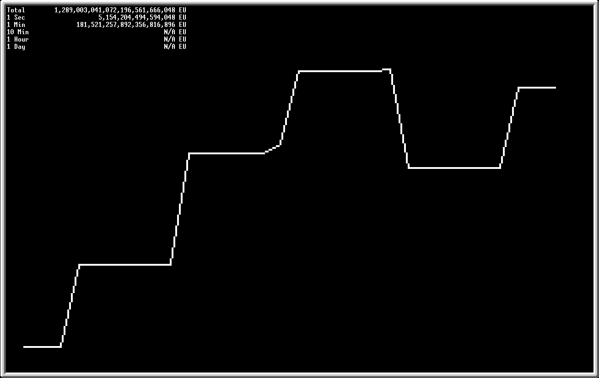

# Energy Net Monitor

A simple [OpenComputer](https://github.com/GTNewHorizons/OpenComputers) script monitors the wireless energy network

Made for modpack [GTNH](https://github.com/GTNewHorizons/GT-New-Horizons-Modpack)

# Features

- Total energy in the network
- Inflow/outflow over given time spans
- Line chart for intuitive visualization of energy changes

# Screenshots

# Acknowledgements

- Bresenham algorithm [bresenham](https://github.com/rm-code/bresenham)
- Braille chart inspired by [plotille](https://github.com/tammoippen/plotille)
